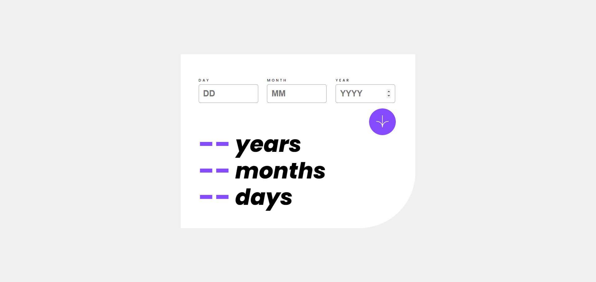

# pablodev - Age calculator app solution

### Notes of coder in PT-BR

Opa guys, mais uma solução na trajetoria do aprendizado da linguagem JavaScript, sinto que vou avançando minhas linhas conforme codo, dessa vez tive menos ajuda de documentações e IA, uma das coisas que fiquei feliz foi com a idade de criar loops para nevegar entre os meus INPUTS para tratar erros:

``` 
  button.addEventListener('click', () => {

    let isValid = true;

    inputs.forEach((input, index) => {
 ```

This is a solution to the [Age calculator app challenge on Frontend Mentor](https://www.frontendmentor.io/challenges/age-calculator-app-dF9DFFpj-Q). Frontend Mentor challenges help you improve your coding skills by building realistic projects. 

## Overview



### Links

- Solution URL: [Repositore github](https://github.com/Pabloodev/age-calculator)
- Live Site URL: [Add live site URL here](https://your-live-site-url.com)

## My process

### Built with

- Semantic HTML5 markup
- CSS custom properties
- Flexbox
- loops in JS


### Continued development

I intend to continue developing in the language, mainly for error handling as well as handling forms in JS!!


## Author

- Website - [portfolio](https://www.pabloteixeira.site)
- Frontend Mentor - [@pabloodev](https://www.frontendmentor.io/profile/pabloodev)

#### thank you guys!!